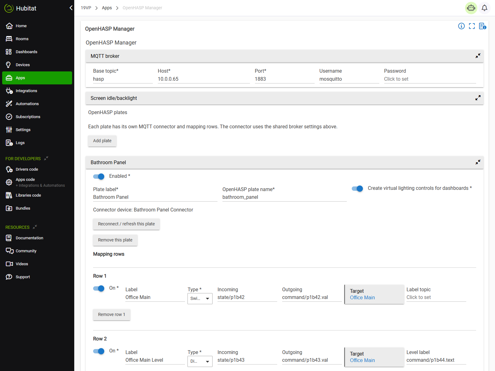

# Hubitat OpenHASP

Reusable Hubitat integration for OpenHASP MQTT touch panels.

Version 0.4.7 uses one `OpenHASP Manager` app plus one `OpenHASP Connector` child driver per plate. The connector owns MQTT directly using Hubitat's `interfaces.mqtt`; MQTT Import and MQTT Export are not required for OpenHASP runtime.

The MCP/server tooling used during development is not part of day-to-day operation. Once installed, the integration runs on the Hubitat hub and talks to the configured MQTT broker.

## Architecture

- `OpenHASP Manager` is a single configuration page for all plates.
- Shared MQTT broker settings appear in one collapsible manager section.
- Shared screen/backlight settings appear in one collapsible manager section.
- Each plate appears as a collapsible section with identity settings and compact mapping rows.
- Each plate gets one child `OpenHASP Connector` driver device.
- The connector subscribes to `hasp/<plate>/state/#` and `hasp/<plate>/LWT`.
- The manager publishes state back to `hasp/<plate>/command/...` and `hasp/<plate>/config/...`.
- Mapping rows bind OpenHASP object topics to real Hubitat devices.
- Optional virtual lighting controls can be created for dashboards.
- Generic boost timers are provided by the optional single-instance `Boost Timer` app and `Boost Timer Device`; OpenHASP can trigger and display them, but the timing behavior is reusable outside OpenHASP.

Supported native Hubitat row types include switch, dimmer, button, lock, temperature, humidity, illuminance, contact, and motion. Optional row types are discovered through Hubitat Location Events. The optional Boost Timer app registers the Boost timer row type when installed/initialized, so it only appears as a normal dropdown option when that integration is present and has answered discovery.

## Current Bathroom Example

The default control map matches a 480x480 `bathroom_panel` page:

| Type | Label | Incoming | Outgoing | Target |
| --- | --- | --- | --- | --- |
| switch | Office Main | `state/p1b42` | `command/p1b42.val` | `Office Main` |
| dimmer | Office Main Level | `state/p1b43` | `command/p1b43.val` | `Office Main`; label `command/p1b44.text` |
| switch | Bedroom Main | `state/p1b52` | `command/p1b52.val` | `Bedroom Main` |
| dimmer | Bedroom Main Level | `state/p1b53` | `command/p1b53.val` | `Bedroom Main`; label `command/p1b54.text` |
| timerButton | Underfloor Heating | `state/p1b21` | n/a | virtual UFH switch |

Screen defaults:

- idle topic: `state/idle`
- backlight topic: `command/backlight`
- GUI config topic: `config/gui`
- idle seconds: `60`
- normal brightness: `42`
- wake brightness: `255`

For testing, the timer defaults to a 1 minute increment and a 3 minute maximum. For production, set the timer preferences to 60 and 180 minutes.

For a reusable setup, install the optional `Boost Timer` app from HPM, add a named timer instance for the heating circuit, then select that instance's `Boost Timer Device` directly in the OpenHASP timer row's `Timer target` field. The row will call `boost()` on the device and mirror its `displayText` and switch state back to the panel.

## Installation

### Hubitat Package Manager

Add this repository manifest to HPM as a custom repository:

```text
https://raw.githubusercontent.com/NichUK/Hubitat-OpenHASP/main/repository.json
```

Install `Hubitat OpenHASP`.

HPM reads the package definition from `packageManifest.json` and installs the required `OpenHASP Manager` app and `OpenHASP Connector` driver. It can also install the optional generic `Boost Timer` app and `Boost Timer Device` driver. Hubitat's manual `Add user app` screen only adds the app code; when installing manually, add matching drivers separately from `Drivers Code`.

### Manual Install

Install:

- `apps/openhasp-manager.groovy`
- `drivers/openhasp-connector.groovy`

## Quick Start

1. Configure the OpenHASP plate to use your MQTT broker.
2. Set the OpenHASP plate name, for example `bathroom_panel`.
3. Open Hubitat Apps and add `OpenHASP Manager`.
4. Use the default bathroom plate or add another plate.
5. Enter MQTT broker host, port, username, and password in the top MQTT broker section.
6. Set screen idle/backlight defaults in the next section.
7. Select the real Hubitat target devices for each mapping row.
8. Leave virtual controls enabled if you want dashboard-friendly child devices.
9. Save the app.

The connector will create a child device, connect to MQTT, subscribe to panel state topics, publish retained GUI config, and mirror Hubitat target state back to OpenHASP command topics.

Commands from the panel go to Hubitat target devices. State from Hubitat target devices is mirrored back to the panel. Panel-originated commands are not immediately echoed back to the same panel object, which avoids slider and switch bounce.

See [Configuration](docs/configuration.md) for the full walkthrough.
See [Type Registry](docs/type-registry.md) for the shared row-type extension contract.



## OpenHASP MQTT Requirements

OpenHASP should publish and subscribe using topics like:

```text
hasp/<plateName>/state/<objectId>
hasp/<plateName>/command/<objectId.property>
hasp/<plateName>/config/gui
```

For the bathroom panel:

```text
plateName = bathroom_panel
```

## Development

Run tests:

```powershell
./gradlew test
```

Pure logic lives in `src/main/groovy/uk/co/nichuk/hubitat/openhasp/OpenHaspSupport.groovy`; deployable Hubitat code is in `apps/` and `drivers/`.

## License

Apache License 2.0. See [LICENSE](LICENSE) and [NOTICE](NOTICE).
