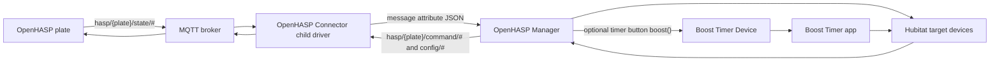

# Developer Notes

## Runtime Architecture

Version 0.4.0 uses a direct MQTT connector per OpenHASP plate.



`OpenHASP Connector` uses Hubitat `interfaces.mqtt`. It connects to the configured broker, subscribes to `hasp/<plate>/state/#` and `hasp/<plate>/LWT`, and emits every incoming MQTT event as a JSON `message` attribute:

```json
{"sequence":1,"topic":"hasp/bathroom_panel/state/p1b42","payload":"{\"event\":\"up\",\"val\":1}","at":1782042000000}
```

`OpenHASP Manager` subscribes to those child-device `message` events, routes by plate prefix, matches a mapping row, and commands Hubitat targets.

## Feedback Rules

Panel-originated commands go to Hubitat target devices. They are not immediately mirrored back to the same OpenHASP widget.

Hubitat-originated state changes are mirrored back to OpenHASP command topics.

Dimmer rows publish slider level and label text from Hubitat level state. Switch rows publish `1` or `0`. This separation prevents a switch state event from overwriting a slider level.

Timer rows can target the optional generic `Boost Timer Device`. The device publishes `integrationType=boostTimer` and `openHaspRowType=timerButton`; once a Boost Timer device is selected in OpenHASP Manager optional integrations, `Boost timer` is exposed as a row type. In that mode OpenHASP Manager calls `boost()` and mirrors the device `displayText` and switch state back to the panel. Blank-target timer rows still use the manager's legacy fallback timer for backwards compatibility.

## Tests

The Gradle tests cover:

- OpenHASP payload parsing
- switch, dimmer, timer, and idle normalization
- topic construction per plate
- plate routing by MQTT topic prefix
- mapping-row matching
- GUI config JSON generation
- multi-plate isolation
- Hubitat Groovy syntax parsing for app and driver files

Run:

```powershell
./gradlew test
```

## Release Checklist

1. Run `./gradlew test`.
2. Update `packageManifest.json` version, date, and release notes.
3. Commit and push to `main`.
4. Install/update through HPM or manually on a Hubitat hub.
5. Capture screenshots for `docs/images/` when the Hubitat UI changes.
