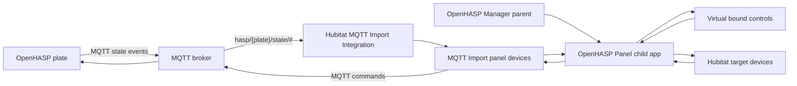

# Developer Notes

## Runtime Architecture

Hubitat's MQTT client interface is available to drivers, not apps. For normal operation this package uses Hubitat's built-in MQTT Import Integration as that MQTT driver layer, then keeps cross-device binding in `OpenHASP Panel` child apps.

OpenHASP publishes object events as JSON payloads. MQTT Import's manual mapper maps whole payloads to attributes and supports enum value mappings, but it does not currently provide JSON-path extraction or arbitrary string command capabilities. For slider controls, use a raw Switch event device for the OpenHASP JSON state topic and a separate SwitchLevel command device for the OpenHASP `.val` command topic.

Dimmer updates have three possible sources: the OpenHASP raw event device, the app-created Hubitat control, and the real target device. When a user requests a new level from the panel or app-created control, `OpenHASP Panel` records that level briefly and mirrors it immediately to the panel command device and virtual control. During that short pending window, older target level reports are ignored so the panel slider cannot bounce back to the previous level before the real device finishes reporting the new one.



## Tests

The local Gradle tests cover the pure logic that must remain stable across Hubitat releases:

- OpenHASP JSON event parsing and actionable event filtering
- level/brightness conversion
- timer increment and maximum behavior
- Hubitat app setting normalization
- bathroom default control map
- MQTT Import raw OpenHASP value normalization

Run:

```powershell
./gradlew test
```

## Release Checklist

1. Run `./gradlew test`.
2. Update `packageManifest.json` version, date, and release notes.
3. Commit and push to `main`.
4. Install/update through HPM on a Hubitat hub.
5. Capture screenshots for `docs/images/` when the Hubitat UI changes.
