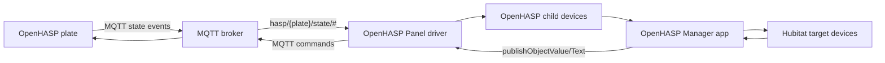

# Developer Notes

## Runtime Architecture

Hubitat's MQTT client interface is available to drivers, not apps. This package therefore keeps MQTT in `OpenHASP Panel` and keeps cross-device binding in `OpenHASP Manager`.



## Tests

The local Gradle tests cover the pure logic that must remain stable across Hubitat releases:

- OpenHASP JSON event parsing
- actionable event filtering
- level/brightness conversion
- timer increment and maximum behavior
- bathroom default control map

Run:

```powershell
./gradlew test
```

## Release Checklist

1. Run `./gradlew test`.
2. Update `packageManifest.json` version, date, and release notes.
3. Commit and push to `main`.
4. Install/update through HPM on a Hubitat hub.
5. Capture screenshots for `docs/images/` when the Hubitat UI changes.
